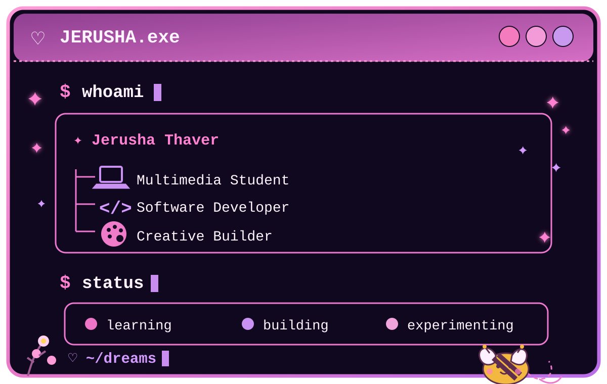

<div align="center">

# ♡ JERUSHA THAVER

###   `ux/ui designer` · `software developer` · `creative technologist`


<br>


<br><br>

🐝 *probably adding an unnecessary animation somewhere*

</div>

---

## ♡ `who am i?`

<p align="center">
  
</p>

I'm a Multimedia student who enjoys turning ideas into **websites, applications, interactive experiences and games**.

I enjoy working across both the technical and creative sides of development — from backend systems and databases to UI design, animations and interactive experiences.

I especially like projects where I can combine **code + design + problem solving**.

---

## ✦ `currently`

|                           |                                        |
| ------------------------- | -------------------------------------- |
| 🎓 **Studying**           | BIS Multimedia                         |
| 💻 **Building**           | Web, mobile & interactive applications |
| 🎨 **Exploring**          | Creative development & UI/UX           |
| 🧠 **Learning**           | VR & full-stack development            |
| 🎮 **Experimenting with** | Unity & interactive experiences        |
| ☕ **Status**              | `coffee → code → debug → repeat`       |

---

# ⌘ `my toolkit`

### ♡ Languages

<p>


</p>

### ✦ Frameworks & Platforms

<p>


</p>

### ୨୧ Creative & Design

<p>


</p>

### ⌘ Tools & Data

<p>


</p>

---

# ◕ `github activity`

<!-- <div align="center">


</div>

<br> -->

<div align="center">


<a href="https://github.com/JerushaThaver">
  
</a>

</div>

---


# ✦ `project universe`

> A few things I've built, experimented with, or am currently working on.
<!--
<br>

### 🌸 BLOOMSET

```text
╭──────────────────────────────────────────────────────╮
│  PROJECT 01                                           │
│                                                      │
│  BLOOMSET                                             │
│  ─────────                                             │
│  An interactive e-commerce experience focused on     │
│  creating a visually engaging shopping interface.    │
│                                                      │
│  HTML • CSS • JavaScript • UI/UX                     │
│                                                      │
│  ● BUILDING                                          │
╰──────────────────────────────────────────────────────╯
```

**What I explored:**

* Interactive UI design
* Responsive layouts
* Product presentation
* Custom animations
* User experience
* Frontend development

**→ [View Project](YOUR_BLOOMSET_LINK)**

---
-->
<!--
### 🎮 UNITY PROJECTS

```text
╭──────────────────────────────────────────────────────╮
│  PROJECT 02                                           │
│                                                      │
│  INTERACTIVE GAME EXPERIENCES                         │
│  ─────────────────────────────                         │
│  Gameplay systems, interactions, physics and          │
│  environmental mechanics built in Unity.             │
│                                                      │
│  Unity • C# • Game Development                        │
│                                                      │
│  ● EXPERIMENTING                                      │
╰──────────────────────────────────────────────────────╯
```

I've been exploring:

* Interactive objects
* Pressure plate mechanics
* Physics interactions
* Character/environment interactions
* Gameplay systems
* Animation-driven interactions

**→ [View Unity Projects](YOUR_UNITY_REPOSITORY)**

---
-->
### 📱 HobbiQuest

```text
╭──────────────────────────────────────────────────────╮
│  PROJECT 01                                          │
│                                                      │
│  MOBILE APPLICATIONS                                 │
│  ───────────────────                                 │
│  A mobile app where you explore one hobby            │
│  for each letter of the alphabet                     │
│                                                      │
│  React • Expo • JavaScript                           │
│                                                      │
│  ● BUILDING                                          │
╰──────────────────────────────────────────────────────╯
```

Areas I've explored:

* Mobile UI
* Application navigation
* Interactive interfaces
* React-based development
* Expo

  
<br>
Features:

* A–Z progress grid
* Photo capture or gallery picker
* Hobby name, rating & notes
* Offline storage with AsyncStorage
* Progress tracker (x / 26)

**→  [View Repository](https://github.com/JerushaThaver/HobbiQuest)**

---


<!--# 🐝 `the little lab`

Not everything needs to become a huge project.

Sometimes I just want to make something weird.

```text
╭────────────────────────────────────────────────────╮
│                                                    │
│   🐝  THE LAB                                     │
│                                                    │
│   ├── interactive text effects                    │
│   ├── canvas experiments                           │
│   ├── cute UI animations                            │
│   ├── CSS experiments                              │
│   ├── Unity mechanics                              │
│   ├── AR experiments                               │
│   ├── AI experiments                               │
│   └── things that sounded cool at 2am              │
│                                                    │
╰────────────────────────────────────────────────────╯
```

I like experimenting with ideas before worrying about whether they're "serious" projects.

---
-->


# ✿ `experience`

### Gendac — Student Vacation Work Programme

**Software Development / Technology**

During my vacation work experience, I gained exposure to a professional software development environment and worked alongside aspiring developers.

Some of the areas I was exposed to included:

* Software development practices
* Professional development workflows
* UI design
* Frontend development
* Problem solving
* Team collaboration

`● EXPERIENCE`

---

# ♡ `how i like to build`

```text
       IDEA
        │
        ↓
   ┌───────────┐
   │ RESEARCH  │
   └─────┬─────┘
         ↓
   ┌───────────┐
   │  DESIGN   │
   └─────┬─────┘
         ↓
   ┌───────────┐
   │   BUILD   │
   └─────┬─────┘
         ↓
   ┌───────────┐
   │  TESTING  │
   └─────┬─────┘
         ↓
   ┌───────────┐
   │  IMPROVE  │
   └─────┬─────┘
         ↓
      ✦ SHIP ✦
```

I enjoy the process of taking an idea from:

**"this could be cool..."**

to

**"wait, I actually built it."**

---


# ♡ `random things about me`

```text
╭──────────────────────────────────────────────╮
                                              
   ✦ I took a solo trip to a new country       
   for my 21st birthday ✈                      
                                                
   ✦ I’d love to explore the future of          
   fashion through technology & design            
   
   ✦ Travelling is one of my favourite ways 
   to get inspired 
   
   ✦ I get weirdly excited about tiny 
   design details 
   
   ✦ I’m currently trying to collect as many 
   interesting experiences as possible  
 
╰──────────────────────────────────────────────╯
```

---

# ❀ `what i'm looking for`

I'm interested in opportunities where I can:

* Build real software
* Learn from experienced developers
* Work on meaningful problems
* Grow as a full-stack developer
* Explore new technologies
* Combine technical and creative thinking
* Contribute to a collaborative team

---

# ✦ `let's connect`

<div align="center">
  
 <a href="YOUR_PORTFOLIO_LINK">

</a>

<a href="https://www.linkedin.com/in/jerusha-thaver-896885284">
  
</a>


<a href="mailto:thaverjerusha19@gmail.com">
  
</a>

</div>

<br>

<div align="center">

### `♡ thanks for stopping by ♡`

🐝

*go build something you think is cool.*

<br>

<p align="center">
  
</p>

</div>
